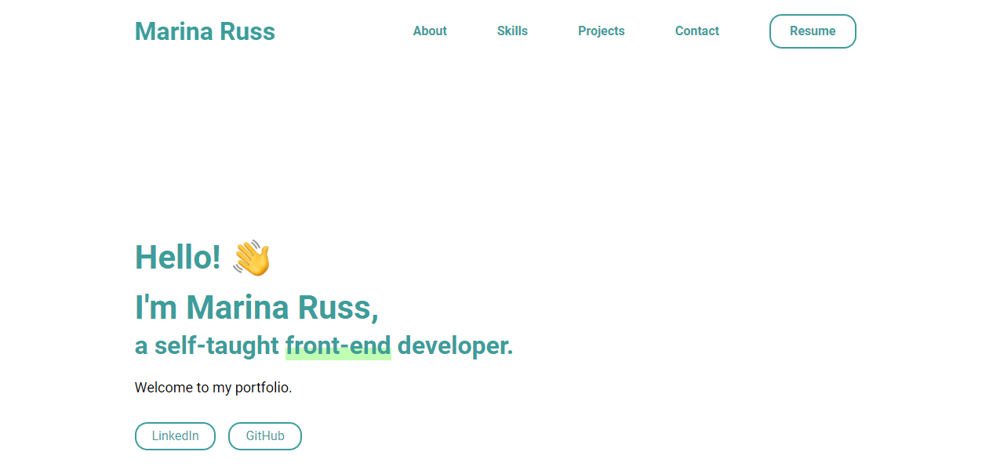

# Portfolio Site

## :book: Table of Contents

1. [Site Preview](#preview)
2. [Credits](#credits)

### :star: Site Preview 

Preview:

[Click here](marinaruss.dev) to visit the live site!

### :heart: Credits 

- [Portfolio Minimal Theme](https://github.com/konstantinmuenster/gatsby-theme-portfolio-minimal) by [ Konstantin Muenster](https://konstantin.digital/)
- Skill Icons from the [devicon](https://github.com/devicons/devicon/tree/master) git repo.
