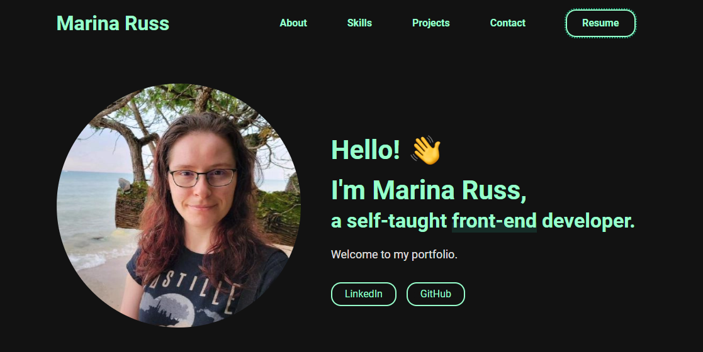

# Portfolio Site

## :book: Table of Contents

1. [Site Preview](#preview)
2. [Techn Used](#tech)
3. [Credits](#credits)

### :star: Live Site 

Preview:

[Click here](marinaruss.dev) to visit the live site!

### :wrench: Tech Used 

- Gatsby
- CSS

### :heart: Credits 

- [Portfolio Minimal Theme](https://github.com/konstantinmuenster/gatsby-theme-portfolio-minimal) by [ Konstantin Muenster](https://konstantin.digital/)
- Skill Icons by [FreePNGLogos](FreePngLogos.com) and [Erik Ragnar Eliasson](https://www.iconfinder.com/Erik_Rgnr) at iconfinder

## TODO:
- sections/settings.json, update placeholder resume image with PDF
